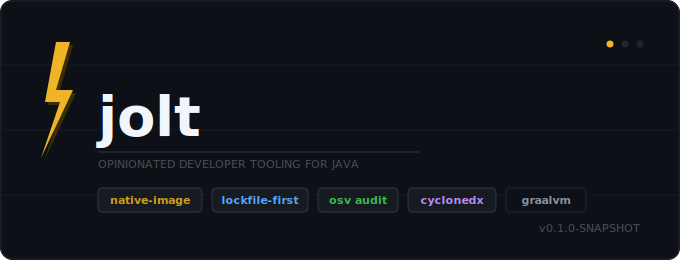

<p align="center">
  
</p>

Opinionated developer tooling for Java. One CLI that replaces your shell aliases for
`mvn`, `gradle`, `docker`, `git`, and JDK management — with a reproducibility guarantee
that none of those aliases provide.

```
Rust    → cargo
Python  → uv / pip
Node    → npm / pnpm
Java    → jolt
```

---

## Installation

### Native binary (Linux / macOS) — recommended

Download the pre-built binary from the [Releases page](https://github.com/your-org/jolt/releases)
and put it on your `$PATH`:

```bash
# Linux x86_64
curl -Lo jolt https://github.com/your-org/jolt/releases/latest/download/jolt-linux-amd64
chmod +x jolt && sudo mv jolt /usr/local/bin/

# macOS (Intel or Apple Silicon)
curl -Lo jolt https://github.com/your-org/jolt/releases/latest/download/jolt-macos-aarch64
chmod +x jolt && sudo mv jolt /usr/local/bin/
```

Cold-start time is under 50 ms because the binary is a GraalVM native image — no JVM warm-up.

### JVM JAR fallback (any platform)

If a native binary is unavailable for your platform, run the fat JAR directly.
Requires Java 21+.

```bash
java -jar jolt-cli-0.1.0-SNAPSHOT.jar <command>
```

Add a wrapper script or shell alias so you can still type `jolt`:

```bash
alias jolt='java -jar /path/to/jolt-cli-0.1.0-SNAPSHOT.jar'
```

---

## Quick start

```bash
jolt doctor                          # check your environment
jolt new spring my-service           # scaffold a Spring Boot app
cd my-service
jolt run                             # start the app
jolt test                            # run all tests
jolt deps add org.projectlombok:lombok
jolt docker init                     # generate Dockerfile + .dockerignore
jolt ci github                       # generate GitHub Actions workflow
jolt info                            # project summary
```

---

## Commands

### `jolt doctor`

Validates your environment: JDK, Maven/Gradle, Git, Docker, and network connectivity
to configured Maven repositories.

```bash
jolt doctor
jolt doctor --json        # machine-readable output for CI
```

Exit 3 if any hard check fails.

---

### `jolt new <template> <name>`

Scaffold a new Java project.

Templates:
- `maven` — plain Maven project with JUnit 5, `.gitignore`, git init
- `library` — Maven library with sources/javadoc publishing config
- `spring` — Spring Boot app with web, actuator, smoke test; resolves current stable
  Spring Boot version at scaffold time

```bash
jolt new spring my-api
jolt new maven my-lib --group com.mycompany
jolt new library my-sdk --java 21
```

After scaffolding, jolt resolves the dependency graph and writes `jolt.lock` automatically.

---

### `jolt run [target] [-- args...]`

Build and run the project's main class.

```bash
jolt run                             # auto-detects @SpringBootApplication or single Main
jolt run com.example.BatchJob        # explicit main class
jolt run --profile prod              # Spring profiles
jolt run --jvm-args "-Xmx512m"
jolt run -- --server.port=9090       # pass args to the program
```

For multi-module reactors, use `--module` to scope to one module.

---

### `jolt test [target]`

Run tests via Maven Surefire or Gradle.

```bash
jolt test                            # all tests
jolt test UserServiceTest            # single class
jolt test UserServiceTest#shouldFindById   # single method
jolt test --affected                 # only modules changed since HEAD~1
jolt test --affected --since main    # compare against a named branch
```

`--affected` intersects the module graph with `git diff` to find changed-or-downstream
modules. Exit 1 on test failure.

---

### `jolt deps`

Dependency management. All sub-commands work for Maven (`pom.xml`) and Gradle (`build.gradle`).

```bash
jolt deps search guava               # search Maven Central
jolt deps add com.google.guava:guava:33.2.1-jre
jolt deps add org.projectlombok:lombok --scope provided
jolt deps remove com.google.guava:guava
jolt deps list                       # declared direct dependencies
jolt deps list --tree                # full resolved graph
jolt deps why io.netty:netty-buffer  # why is this transitive dep here?
jolt deps outdated                   # check for newer versions
jolt deps audit                      # scan for CVEs via OSV API
jolt deps audit --fail-on CRITICAL   # exit 1 only on critical vulns
jolt deps audit --json               # machine-readable vulnerability report
```

`deps add` performs format-preserving edits (preserves comments, whitespace) and
automatically refreshes `jolt.lock`. If a BOM already governs the version, the
`<version>` element is omitted.

---

### `jolt sbom`

Generate a CycloneDX 1.5 SBOM for the project. Output is **byte-identical** across
runs (deterministic serial number, no timestamp) so you can diff it in version control.

```bash
jolt sbom                            # writes bom.json to project root
jolt sbom --format xml               # bom.xml
jolt sbom --output path/to/bom.json  # custom output path
```

---

### `jolt docker`

Generate Dockerfiles and compose configurations.

```bash
jolt docker init                     # multi-stage Dockerfile + .dockerignore
jolt docker init --jlink             # jdeps + jlink + distroless final stage
jolt docker compose                  # docker-compose.yml (port from application.properties)
jolt docker spring-postgres          # Dockerfile + compose with Postgres, healthchecks
```

`docker init` detects Spring Boot and generates a layered image using
`eclipse-temurin:21-jre`. `--jlink` produces a custom minimal JRE via `jdeps`/`jlink`
with a distroless final image.

---

### `jolt ci`

Generate CI pipeline configuration.

```bash
jolt ci github                       # .github/workflows/build.yml
jolt ci gitlab                       # .gitlab-ci.yml
```

Generated pipelines run `jolt` in `--locked` mode so CI verifies reproducibility:
the build fails if `jolt.lock` drifts from `pom.xml`.

---

### `jolt info`

Aggregate project report.

```bash
jolt info
jolt info --json
```

Shows: project type, group:artifact:version, build system, source/test file counts,
Docker and CI configuration status, lockfile status, and module tree for multi-module
reactors.

---

### `jolt clean`

Clean build outputs.

```bash
jolt clean                           # delegates to mvn clean / gradle clean
jolt clean --all                     # also clears jolt's local caches (~/.jolt/cache/)
```

---

### `jolt jdk`

Manage JDK installations.

```bash
jolt jdk list                        # JDKs visible to jolt
jolt jdk install 21                  # download and install Temurin 21
jolt jdk install 21 --distribution graalvm
jolt jdk use 21                      # pin this project's JDK
```

---

### `jolt native`

Compile the project to a GraalVM native image.

```bash
jolt native                          # requires GraalVM with native-image
jolt native --buildpack              # Spring Boot Buildpacks (requires Docker)
```

jolt auto-detects GraalVM from `JAVA_HOME`, `~/.jolt/jdks/`, and `/usr/lib/jvm/`.
Streams compilation progress with elapsed time.

---

### `jolt migrate`

Migrate Java or Spring Boot versions using **OpenRewrite** recipes. After migrating,
prints a file-by-file summary of changes (lines added/removed per file).

```bash
jolt migrate java 21                 # upgrade to Java 21
jolt migrate spring 3.3              # upgrade to Spring Boot 3.3
```

Runs `mvn org.openrewrite.maven:rewrite-maven-plugin:run` under the hood. The recipes
are downloaded automatically from Maven Central on first use.

---

### `jolt sbom` / `jolt deps audit`

Supply-chain commands:

```bash
jolt deps audit                      # CVE scan via OSV.dev API, results cached 24h
jolt deps audit --fail-on CRITICAL   # exit 1 only for critical vulns (default: HIGH)
jolt sbom                            # CycloneDX 1.5 SBOM with SHA-256 checksums
```

---

### Shell completions

```bash
# Bash — add to ~/.bashrc
source <(jolt generate-completion bash)

# Zsh — add to ~/.zshrc
autoload -U compinit && compinit
autoload -U bashcompinit && bashcompinit
source <(jolt generate-completion zsh)
```

---

## The `jolt.lock` reproducibility guarantee

Maven and Gradle resolution is not reproducible across machines:

- Version ranges (`[1.0,2.0)`) resolve differently as new versions publish
- SNAPSHOT versions point to different timestamped artifacts
- `settings.xml` mirror configuration varies per developer
- BOM import ordering affects which version wins when there are conflicts

jolt fixes this by keeping `jolt.lock` — a human-readable file committed to VCS that
pins every resolved artifact: **exact version, scope, resolving repository, and
SHA-256 checksum** of both the JAR and its POM.

```toml
[[package]]
coordinate   = "org.springframework.boot:spring-boot-starter-web:3.4.5"
scope        = "compile"
repository   = "https://repo.maven.apache.org/maven2"
sha256       = "a1b2c3..."
pom_sha256   = "d4e5f6..."
requested_by = ["inventory-service"]
```

Two modes, mirroring `npm install` vs `npm ci`:

- **Update** (default when pom.xml changes): fresh resolution, lockfile refreshed
- **Frozen** (`--locked`, default in generated CI pipelines): resolve strictly from
  `jolt.lock`; exit 4 if anything drifted or a checksum mismatches

This means a second machine, a CI runner, or a colleague six months later gets the
**exact same resolved dependency set** — not a best-effort approximation.

---

## How it compares to just using `mvn`

| Concern | `mvn` alone | `jolt` |
|---|---|---|
| Reproducibility | Not guaranteed — `mvn package` resolves fresh each time | `jolt.lock` pins every artifact + checksum |
| Lockfile | None | `jolt.lock` committed to VCS |
| Affected-module testing | Requires scripting `git diff` + module graph logic | Built-in: `jolt test --affected` |
| CVE scanning | Separate plugin (OWASP, Snyk) | `jolt deps audit` via OSV.dev, 24h cache |
| Gradle + Maven | Separate CLIs, different flags | Same `jolt` commands for both |
| SBOM generation | Separate plugin + configuration | `jolt sbom` → CycloneDX 1.5 JSON/XML |
| Shell completions | None | `jolt generate-completion bash\|zsh` |

**What jolt delegates:** For `run`, `test`, `build`, and `clean`, jolt still calls Maven
or Gradle under the hood. It does not reimplement compilation, packaging, or test
execution. The value is in the commands around those operations: the lockfile, the
dependency graph analysis, the supply-chain tooling, and the project scaffolding.

---

## How it works — the embedded Maven Resolver

The thing that separates jolt from a shell script is that dependency resolution uses
the **Maven Resolver (Aether) library embedded directly** — the same engine that
`mvn` uses, but called programmatically:

```
jolt-adapter-maven
└── org.apache.maven.resolver:maven-resolver-impl    (Aether core)
└── org.apache.maven:maven-model-builder             (effective POM: parent inheritance, BOM imports)
└── org.apache.maven:maven-settings-builder          (mirrors, proxies, auth from ~/.m2/settings.xml)
```

When you run `jolt deps list --tree`, jolt:
1. Reads and resolves your POM's effective model (parent inheritance, property interpolation, BOM imports)
2. Calls Aether's `DependencyCollector` to build the full dependency graph
3. Applies Maven's nearest-wins mediation and scope narrowing
4. Computes SHA-256 checksums from the cached artifact JARs
5. Serializes this as structured data — `DependencyGraph` / `DependencyNode` records

This structured graph then drives everything else: lockfile generation, SBOM output,
vulnerability scanning, `deps why`, affected-module analysis.

For Gradle projects, jolt injects a **Groovy init script** via the Gradle Tooling API
that iterates the resolved configurations (`compileClasspath`, `runtimeClasspath`,
`testCompileClasspath`, `testRuntimeClasspath`), computes SHA-256 checksums, and
writes the result as JSON to a temp file — same structured model, same lockfile format.

A senior Java engineer can trust jolt's resolution output because it uses the same
canonical engine as `mvn`, not a re-implementation or text-scraping layer.

---

## Building from source

```bash
git clone https://github.com/your-org/jolt
cd jolt
mvn package -DskipTests        # builds jolt-cli/target/jolt-cli-*.jar
```

Native image (requires GraalVM 21+):

```bash
mvn -Pnative native:compile -pl jolt-cli
# Produces: jolt-cli/target/jolt
```

---

## License

Apache 2.0
